# Disaster Severity Classification

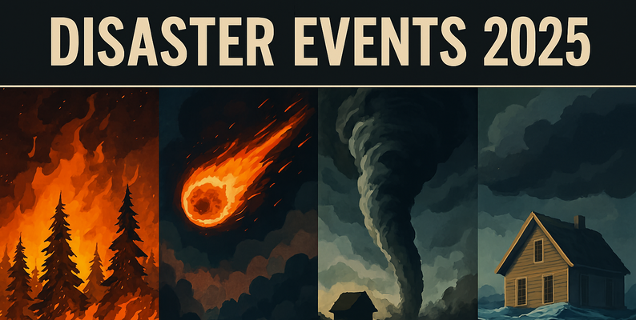

## Project Description

Proyek ini merupakan aplikasi web berbasis **Streamlit** yang dirancang untuk melakukan klasifikasi tingkat keparahan bencana alam ke dalam tiga kategori utama, yaitu **Minor**, **Moderate**, dan **Severe**. Proses klasifikasi dilakukan menggunakan tiga pendekatan model machine learning yang berbeda, yaitu **Multilayer Perceptron (MLP)**, **TabNet**, dan **FT-Transformer**.

Aplikasi memungkinkan pengguna untuk memasukkan data kejadian bencana baik secara manual maupun dalam bentuk batch, kemudian menampilkan hasil prediksi tingkat keparahan dari ketiga model secara bersamaan. Proyek ini dikembangkan menggunakan bahasa **Python** dengan manajemen dependensi berbasis **PDM**.

**Repository:** [https://github.com/muhhanif27/UAP_ML](https://github.com/muhhanif27/UAP_ML)

---

## Dataset dan Preprocessing

Dataset yang digunakan bersumber dari Kaggle dengan judul **Disaster Events 2025**.

**Link Dataset:** [https://www.kaggle.com/datasets/emirhanakku/disaster-events-2025/data](https://www.kaggle.com/datasets/emirhanakku/disaster-events-2025/data) Dataset ini berisi sekitar 20.000 data kejadian bencana alam sintetis yang dirancang untuk menyerupai pola kejadian dunia nyata, seperti gempa bumi, banjir, kebakaran hutan, badai, kekeringan, longsor, dan letusan gunung berapi.

### Struktur Dataset

| Kolom                         | Deskripsi                                  |
| ----------------------------- | ------------------------------------------ |
| `event_id`                    | ID unik kejadian                           |
| `disaster_type`               | Jenis bencana alam                         |
| `location`                    | Negara kejadian                            |
| `latitude`                    | Koordinat lintang                          |
| `longitude`                   | Koordinat bujur                            |
| `date`                        | Tanggal kejadian                           |
| `severity_level`              | Skor intensitas bencana (1–10)             |
| `affected_population`         | Estimasi jumlah penduduk terdampak         |
| `estimated_economic_loss_usd` | Estimasi kerugian ekonomi (USD)            |
| `response_time_hours`         | Waktu respons pertama (jam)                |
| `aid_provided`                | Status bantuan (Yes/No)                    |
| `infrastructure_damage_index` | Indeks kerusakan infrastruktur (0–1)       |
| `is_major_disaster`           | Label awal (tidak digunakan saat training) |

### Fitur yang Digunakan

**Fitur Numerik**:

* `severity_level`
* `affected_population`
* `estimated_economic_loss_usd`
* `response_time_hours`
* `infrastructure_damage_index`
* `latitude`
* `longitude`

**Fitur Kategorikal**:

* `disaster_type`
* `location`
* `aid_provided`

### Target Klasifikasi

Target baru bernama `disaster_severity_class` dibentuk menggunakan pendekatan rule-based scoring berdasarkan threshold beberapa fitur utama:

* **0 → Minor**
* **1 → Moderate**
* **2 → Severe**

Kolom yang tidak digunakan dalam proses training dan di-drop adalah:

* `event_id`
* `date`
* `is_major_disaster`

### Tahapan Preprocessing

1. Label Encoding untuk seluruh fitur kategorikal.
2. Standard Scaling untuk fitur numerik.
3. Pembagian data secara stratified menjadi 70% data training, 15% validation, dan 15% testing.
4. Penyimpanan objek `StandardScaler` dan `LabelEncoder` untuk keperluan inference.

---

## Model yang Digunakan

### 1. Multilayer Perceptron (MLP)

Model neural network sederhana yang dibangun menggunakan TensorFlow/Keras.

* Arsitektur: Dense(64, ReLU) → Dropout(0.3) → Dense(32, ReLU) → Dense(3, Softmax)
* Optimizer: Adam
* Loss Function: Sparse Categorical Crossentropy
* Early Stopping: Berdasarkan `val_loss` dengan patience = 15

### 2. TabNet

Model deep learning khusus untuk data tabular berbasis mekanisme attention.

* Decision Steps: 5
* Parameter utama: n_d = 16, n_a = 16, gamma = 1.5
* Optimizer: Adam (learning rate = 2e-2)
* Early Stopping: Berdasarkan validation accuracy (patience = 30)

### 3. FT-Transformer

Model transformer untuk data tabular yang diimplementasikan menggunakan library `rtdl_revisiting_models`.

* Jumlah Transformer Blocks: 4
* Dimensi blok (d_block): 32
* Attention Heads: 8
* Optimizer: AdamW (learning rate = 1e-4, weight decay = 1e-5)
* Early Stopping: Berdasarkan `val_accuracy` dengan patience = 15

---

## Evaluasi dan Perbandingan Model

Seluruh model dievaluasi menggunakan test set dengan pendekatan **macro-averaged metrics** untuk memastikan performa yang seimbang di setiap kelas.

### Perbandingan Performa

| Model              | Accuracy   | Precision (Macro) | Recall (Macro) | F1-Score (Macro) |
| ------------------ | ---------- | ----------------- | -------------- | ---------------- |
| MLP                | 96.67%     | 96.73%            | 96.16%         | 96.43%           |
| TabNet             | 99.20%     | 99.28%            | 98.93%         | 99.10%           |
| **FT-Transformer** | **99.40%** | **99.33%**        | **99.39%**     | **99.36%**       |

**Kesimpulan:** FT-Transformer menunjukkan performa terbaik secara keseluruhan, diikuti oleh TabNet. MLP tetap memberikan performa yang cukup baik sebagai baseline.

---

## Visualisasi Hasil

Seluruh visualisasi hasil training dan evaluasi model disusun dalam bentuk tabel untuk memudahkan perbandingan.

### Confusion Matrix

| Model          | Visualisasi                            |
| -------------- | -------------------------------------- |
| MLP            |              |
| TabNet         | 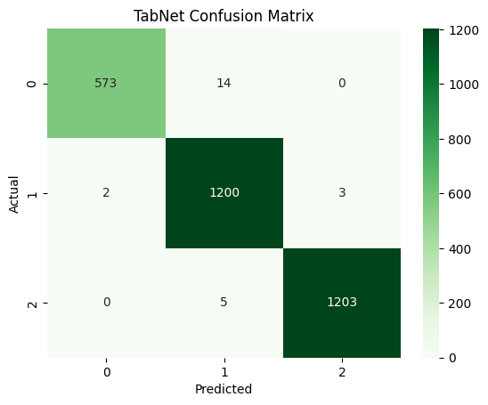          |
| FT-Transformer | 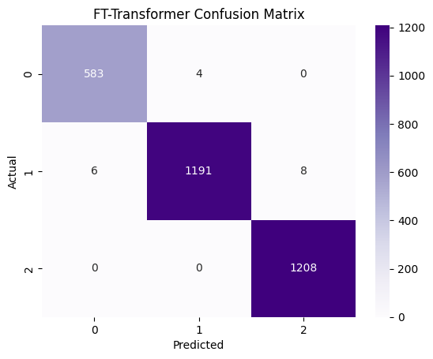 |

### Plot Loss dan Accuracy

| Model          | Loss Plot                                | Accuracy Plot                                |
| -------------- | ---------------------------------------- | -------------------------------------------- |
| MLP            | 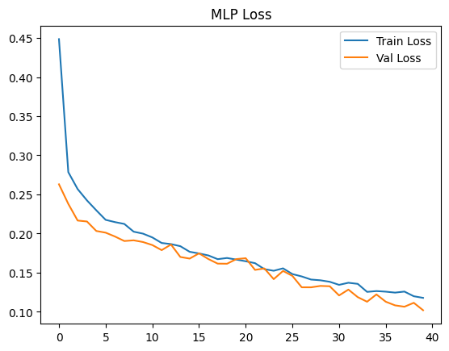             | 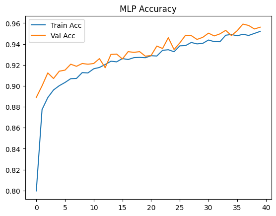             |
| TabNet         |            | 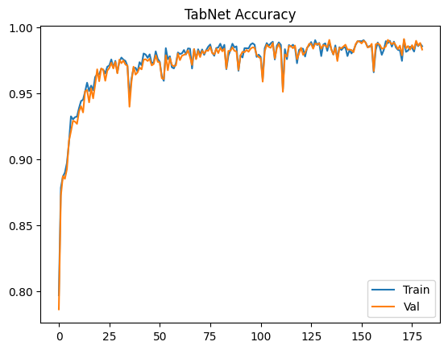          |
| FT-Transformer | 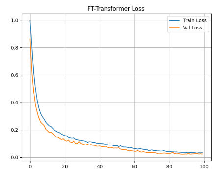 | 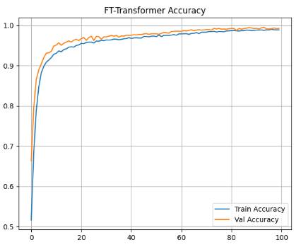 |

---

## Cara Menggunakan Aplikasi Web

Aplikasi ini menyediakan antarmuka web berbasis Streamlit yang intuitif untuk melakukan prediksi tingkat keparahan bencana menggunakan tiga model yang tersedia.

### Alur Penggunaan Umum

1. **Pilih Model**
   Pada bagian atas halaman, pengguna dapat memilih model machine learning yang ingin digunakan, yaitu **MLP**, **TabNet**, atau **FT-Transformer**.

2. **Pilih Mode Prediksi**
   Aplikasi menyediakan dua mode prediksi:

   * **Single Prediction** (default)
   * **Batch Prediction (CSV)**

### Single Prediction

* Mode ini tersedia secara default saat aplikasi pertama kali dibuka.
* Pengguna diminta untuk mengisi **form input** yang berisi fitur-fitur kejadian bencana (numerik dan kategorikal).
* Setelah seluruh field diisi, klik tombol **Predict**.
* Aplikasi akan menampilkan:

  * **Hasil prediksi kelas keparahan** (Minor / Moderate / Severe)
  * **Confidence score (probabilitas)** untuk setiap kelas

### Batch Prediction (CSV)

* Pengguna dapat beralih ke mode batch dengan memilih opsi **Upload CSV**.
* Unggah file CSV dengan format kolom yang sesuai dengan dataset training.
* Klik tombol **Predict**.
* Aplikasi akan menampilkan hasil prediksi untuk seluruh data dalam file CSV, yang dapat ditinjau langsung di tabel output.

---

## Tampilan Antarmuka Aplikasi

Berikut adalah beberapa cuplikan tampilan antarmuka aplikasi web:

| Tampilan | Preview                   |
| -------- | ------------------------- |
| View 1   |  |
| View 2   | 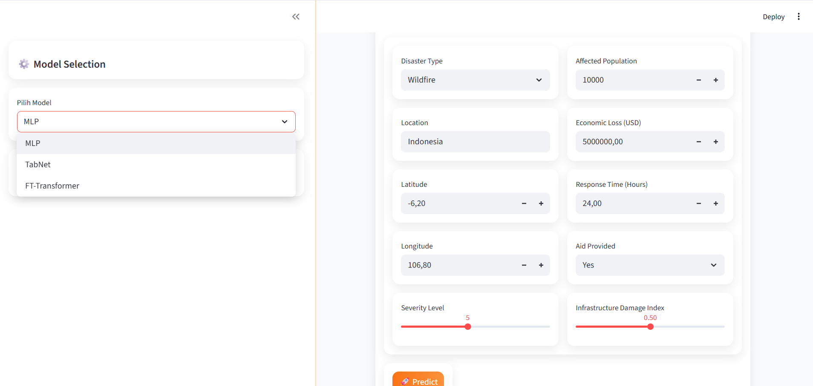 |
| View 3   | 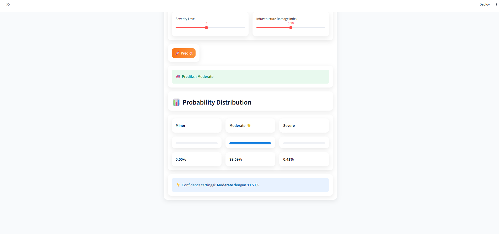 |
| View 4   | 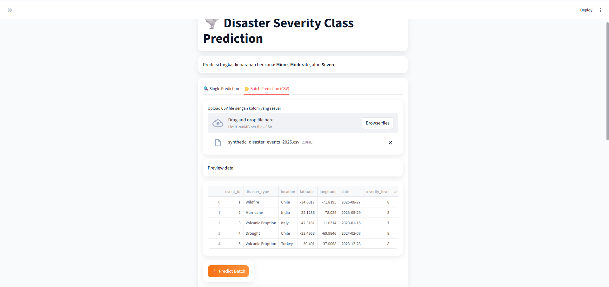 |
| View 5   | 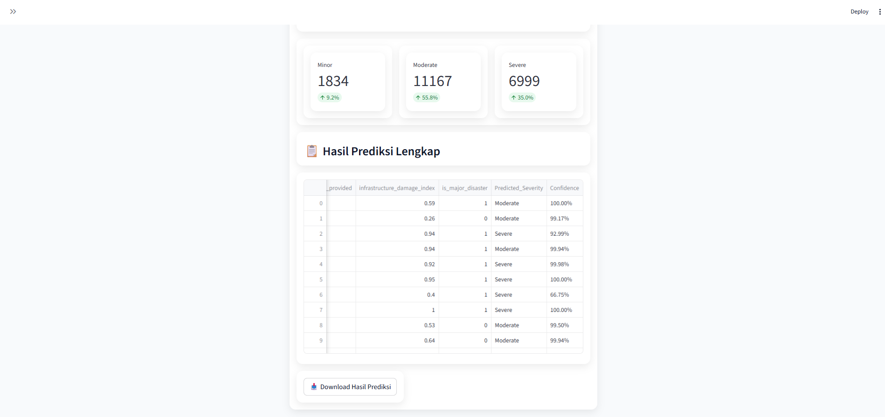 |

---

## Cara Menjalankan Aplikasi Secara Lokal

Proyek ini menggunakan **PDM** sebagai dependency manager.

### Langkah-langkah Instalasi

1. Clone repository:

```bash
git clone https://github.com/muhhanif27/UAP_ML.git
cd UAP_ML
```

2. Install PDM (jika belum tersedia):

```bash
pip install pdm
```

3. Tambahkan dependensi utama (jika belum tercantum di `pyproject.toml`):

```bash
pdm add numpy pandas matplotlib seaborn scikit-learn tensorflow torch pytorch-tabnet rtdl_revisiting_models joblib streamlit
```

4. Sinkronisasi dependensi:

```bash
pdm sync
```

5. Jalankan aplikasi Streamlit:

```bash
pdm run streamlit run app.py
```

6. Akses aplikasi melalui browser:

```
http://localhost:8501
```

**Catatan:** Pastikan file dataset CSV berada pada direktori `src/dataset/` dan seluruh model yang telah dilatih tersedia pada folder yang sesuai sebelum menjalankan aplikasi.

---

## Informasi Pengembang

* **Nama**: Muhammad Hanif
* **NIM**: 202210370311265
* **Kelas**: Pembelajaran Mesin B

---

Selamat mencoba dan semoga bermanfaat 🚀
