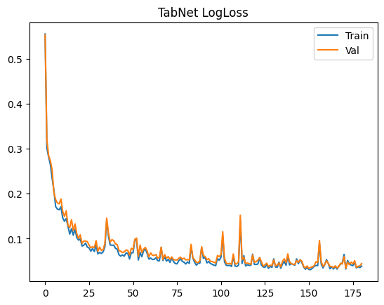

# Disaster Severity Classification

## Project Description
Proyek ini adalah aplikasi web berbasis Streamlit untuk mengklasifikasikan tingkat keparahan bencana alam menjadi tiga kategori: **Minor**, **Moderate**, dan **Severe**. Klasifikasi dilakukan menggunakan tiga model machine learning: Multilayer Perceptron (MLP), TabNet, dan FT-Transformer.

Aplikasi ini memungkinkan pengguna memasukkan detail kejadian bencana secara manual atau batch, kemudian mendapatkan prediksi tingkat keparahan dari ketiga model sekaligus. Proyek dibangun menggunakan Python dengan manajemen dependensi melalui **PDM**.

**Repository:** [https://github.com/muhhanif27/UAP_ML](https://github.com/muhhanif27/UAP_ML)

---

## Dataset dan Preprocessing
Dataset bersumber dari Kaggle: [Disaster Events 2025](https://www.kaggle.com/datasets/emirhanakku/disaster-events-2025/data)  
Berisi 20.000 data kejadian bencana alam sintetis yang meniru pola kejadian dunia nyata (gempa bumi, banjir, kebakaran hutan, badai, kekeringan, longsor, dan letusan gunung berapi).

### Kolom Dataset
| Column | Description |
| :--- | :--- |
| `event_id` | Unique event ID |
| `disaster_type` | Jenis bencana alam |
| `location` | Negara kejadian |
| `latitude / longitude` | Koordinat geografis kejadian |
| `date` | Tanggal kejadian |
| `severity_level` | Skor intensitas (1-10) |
| `affected_population` | Estimasi jumlah penduduk terdampak |
| `estimated_economic_loss_usd` | Estimasi kerugian ekonomi (USD) |
| `response_time_hours` | Waktu respons pertama (jam) |
| `aid_provided` | Bantuan diberikan (Yes/No) |
| `infrastructure_damage_index` | Indeks kerusakan infrastruktur (0-1) |
| `is_major_disaster` | Label target awal (tidak dipakai di training) |

### Fitur yang Digunakan untuk Klasifikasi
* **Fitur Numerik**: `severity_level`, `affected_population`, `estimated_economic_loss_usd`, `response_time_hours`, `infrastructure_damage_index`, `latitude`, `longitude`
* **Fitur Kategorikal**: `disaster_type`, `location`, `aid_provided`

### Target Class
Target baru dibuat bernama `disaster_severity_class` dengan aturan scoring berbasis threshold pada beberapa fitur utama:
* **0 → Minor**
* **1 → Moderate**
* **2 → Severe**

> **Note:** Kolom yang di-drop saat training: `event_id`, `date`, `is_major_disaster`.

### Langkah Preprocessing
1. Label encoding pada kolom kategorikal.
2. Standard scaling pada kolom numerik.
3. Split data: 70% train, 15% validation, 15% test (stratified).
4. Simpan `StandardScaler` dan `LabelEncoder` untuk inference.

---

## Model yang Digunakan

### 1. Multilayer Perceptron (MLP)
Model neural network sederhana berbasis TensorFlow/Keras:
* **Layer**: Dense(64, ReLU) → Dropout(0.3) → Dense(32, ReLU) → Dense(3, softmax)
* **Optimizer**: Adam
* **Loss**: sparse categorical crossentropy
* **Early stopping**: berdasarkan `val_loss` (patience=15)

### 2. TabNet
Model deep learning khusus tabular data dari library `pytorch-tabnet`:
* **Arsitektur**: Attention-based dengan 5 decision steps
* **Hyperparameters**: n_d = n_a = 16, gamma = 1.5
* **Optimizer**: Adam (lr=2e-2)
* **Early stopping**: berdasarkan valid accuracy (patience=30)

### 3. FT-Transformer
Model transformer untuk data tabular dari library `rtdl_revisiting_models`:
* **Arsitektur**: 4 transformer blocks, d_block=32, 8 attention heads
* **Embedding**: Numerical features ditokenisasi, categorical di-embed
* **Optimizer**: AdamW (lr=1e-4, weight_decay=1e-5)
* **Early stopping**: berdasarkan `val_accuracy` (patience=15)

---

## Hasil Evaluasi dan Perbandingan Model
Ketiga model dievaluasi pada test set menggunakan metrik macro-averaged.

### Perbandingan Performa Model
| Model | Accuracy | Precision (macro) | Recall (macro) | F1-Score (macro) |
| :--- | :--- | :--- | :--- | :--- |
| MLP | 96.67% | 96.73% | 96.16% | 96.43% |
| TabNet | 99.20% | 99.28% | 98.93% | 99.10% |
| **FT-Transformer** | **99.40%** | **99.33%** | **99.39%** | **99.36%** |

**Kesimpulan**: FT-Transformer memberikan performa terbaik, diikuti TabNet. MLP sebagai baseline tetap cukup baik namun sedikit kalah akurasinya.

### Visualisasi (Confusion Matrix & Training Plots)
Berikut adalah visualisasi performa model (pastikan path gambar sesuai di repository Anda):

#### Confusion Matrix


#### Plot Loss & Accuracy
 
 
 

---

## Cara Menjalankan Aplikasi Secara Lokal
Proyek ini menggunakan **PDM** untuk manajemen dependensi.

### Langkah-langkah
1.  **Clone repository**:
    ```bash
    git clone [https://github.com/muhhanif27/UAP_ML.git](https://github.com/muhhanif27/UAP_ML.git)
    cd UAP_ML
    ```

2.  **Install PDM** (jika belum ada):
    ```bash
    pip install pdm
    ```

3.  **Tambahkan dependensi utama** (jika belum ada di pyproject.toml):
    ```bash
    pdm add numpy pandas matplotlib seaborn scikit-learn tensorflow torch pytorch-tabnet rtdl_revisiting_models joblib streamlit
    ```

4.  **Sync dependensi**:
    ```bash
    pdm sync
    ```

5.  **Jalankan aplikasi Streamlit**:
    ```bash
    pdm run streamlit run app.py
    ```
    *(Sesuaikan nama file utama Streamlit Anda, misalnya app.py atau yang ada di root/src)*

6.  **Akses Aplikasi**:
    Buka browser di [http://localhost:8501](http://localhost:8501)

> **Penting**: Pastikan dataset CSV berada di `src/dataset/` dan model-model sudah tersedia di folder yang sesuai sebelum menjalankan aplikasi.

Selamat mencoba! 🚀